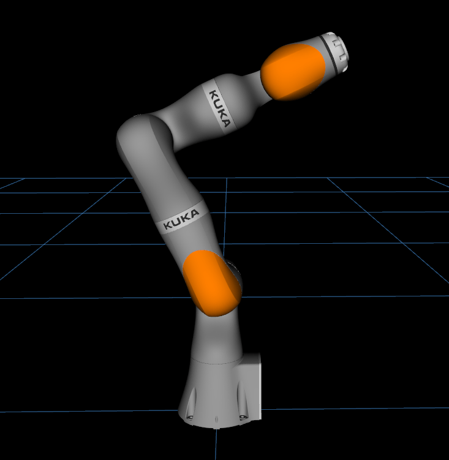
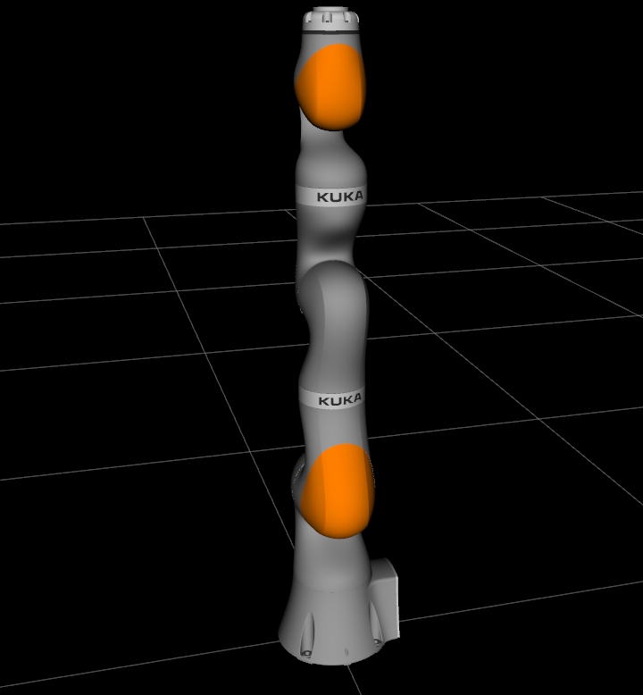
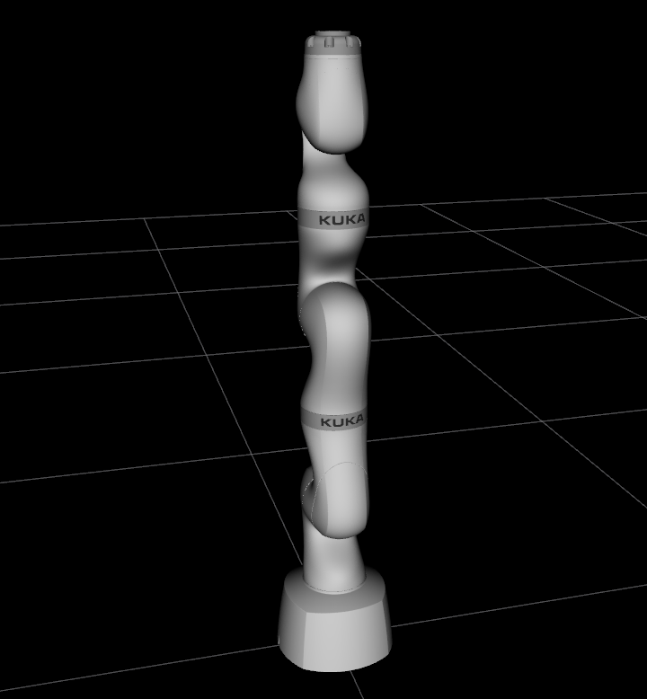
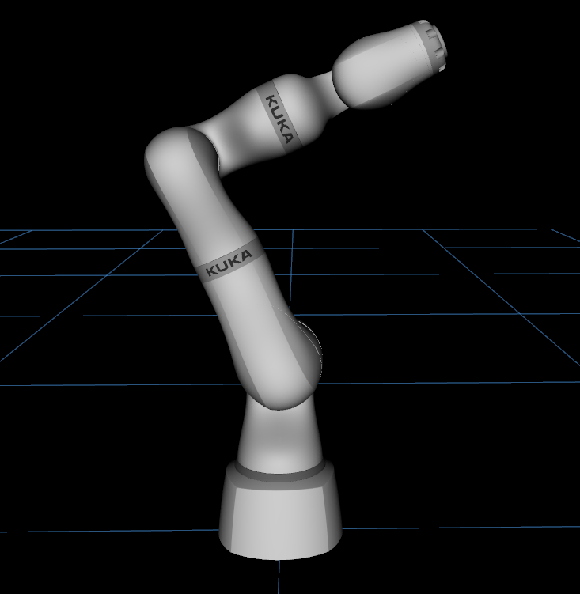

# lbr_fri_ros2_stack
[](https://github.com/lbr-stack/lbr_fri_ros2_stack/actions)
[](https://github.com/lbr-stack/lbr_fri_ros2_stack/tree/humble?tab=Apache-2.0-1-ov-file#readme) 
[](https://lbr-stack.readthedocs.io/en/latest/?badge=latest)
[](https://joss.theoj.org/papers/c43c82bed833c02503dd47f2637192ef) 
[](https://github.com/psf/black)

ROS 2 packages for the KUKA LBR, including communication to the real robot via the Fast Robot Interface ([FRI](https://github.com/lbr-stack/fri)) and [Gazebo](http://gazebosim.org/) simulation support. Included are the `iiwa7`, `iiwa14`, `med7`, and `med14`.

<body>
    <table>
        <tr>
            <th align="left" width="25%">LBR IIWA7 R800</th>
            <th align="left" width="25%">LBR IIWA14 R820</th>
            <th align="left" width="25%">LBR Med7 R800</th>
            <th align="left" width="25%">LBR Med14 R820</th>
        </tr>
        <tr>
            <td align="center"></td>
            <td align="center"></td>
            <td align="center"></td>
            <td align="center"></td>
        </tr>
    </table>
</body>

## Documentation
Full documentation available [here](https://lbr-stack.readthedocs.io/en/latest/?badge=latest).

## Quick Start
1. Install ROS 2 development tools
    ```shell
    sudo apt install ros-dev-tools
    ```

2. Create a workspace, clone, and install dependencies
    ```shell
    mkdir -p lbr-stack/src && cd lbr-stack
    vcs import src --input https://raw.githubusercontent.com/lbr-stack/lbr_fri_ros2_stack/humble/lbr_fri_ros2_stack/repos.yaml
    rosdep install --from-paths src -i -r -y
    ```

3. Build
    ```shell
    colcon build --symlink-install --cmake-args -DFRI_CLIENT_VERSION=1.15 --no-warn-unused-cli # replace by your FRI client version
    ```

> [!NOTE]
> FRI client is added as external CMake project via [fri_vendor](https://github.com/lbr-stack/fri_vendor) and must be available as branch, refer [README](https://github.com/lbr-stack/fri?tab=readme-ov-file#contributing).

4. Launch the simulation via
    ```shell
    source install/setup.bash
    ros2 launch lbr_bringup bringup.launch.py \
        model:=iiwa7 # [iiwa7, iiwa14, med7, med14] \
        sim:=true # [true, false] \
        rviz:=true # [true, false] \
        moveit:=true # [true, false]
    ```

> [!TIP]
> List all arguments for the launch file via `ros2 launch lbr_bringup bringup.launch.py -s`

Now, run the [demos](https://lbr-fri-ros2-stack-doc.readthedocs.io/en/humble/lbr_fri_ros2_stack/lbr_demos/doc/lbr_demos.html). To get started with the real robot, checkout the [Documentation](https://lbr-stack.readthedocs.io/en/latest/?badge=latest) above.

## Citation
If you enjoyed using this repository for your work, we would really appreciate ❤️ if you could cite it, as it helps us to continue offering support.

```
@misc{huber2023lbrstack,
      title={LBR-Stack: ROS 2 and Python Integration of KUKA FRI for Med and IIWA Robots}, 
      author={Martin Huber and Christopher E. Mower and Sebastien Ourselin and Tom Vercauteren and Christos Bergeles},
      year={2023},
      eprint={2311.12709},
      archivePrefix={arXiv},
      primaryClass={cs.RO}
}
```

## Acknowledgements


This work was supported by core and project funding from the Wellcome/EPSRC [WT203148/Z/16/Z; NS/A000049/1; WT101957; NS/A000027/1]. 


This project has received funding from the European Union's Horizon 2020 research and innovation programme under grant agreement No 101016985 (FAROS project).
