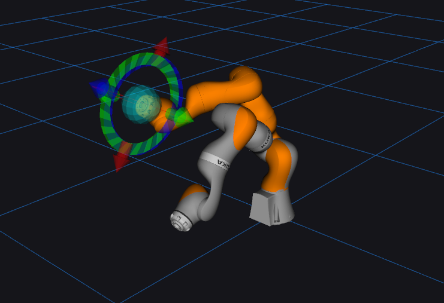

lbr_demos_moveit_py
===================
.. warning::
    On hardware, do always execute in ``T1`` mode first.

MoveIt via RViZ
-----------------

**IIWA 7 R800 in RViZ**

To run MoveIt via RViZ, simply follow:

#. Client side configurations:

    #. Configure the ``client_command_mode`` to ``position`` in `lbr_system_parameters.yaml <https://github.com/lbr-stack/lbr_fri_ros2_stack/blob/humble/lbr_ros2_control/config/lbr_system_parameters.yaml>`_:octicon:`link-external`
    #. Set the ``update_rate`` to ``100`` in `lbr_controllers.yaml <https://github.com/lbr-stack/lbr_fri_ros2_stack/blob/humble/lbr_ros2_control/config/lbr_controllers.yaml>`_:octicon:`link-external`

#. Remote side configurations:

    #. .. dropdown:: Launch the ``LBRServer`` application on the ``KUKA smartPAD``

        .. thumbnail:: ../../doc/img/applications_lbr_server.png

    #. Select

        - ``FRI send period``: ``10 ms``
        - ``IP address``: ``your configuration``
        - ``FRI control mode``: ``POSITION_CONTROL`` or ``JOINT_IMPEDANCE_CONTROL``
        - ``FRI client command mode``: ``POSITION``

#. Run the robot driver:

    .. code-block:: bash

        ros2 launch lbr_bringup bringup.launch.py \
            moveit:=true \
            sim:=false \
            model:=iiwa7 # [iiwa7, iiwa14, med7, med14]

#. You can now move the robot via MoveIt in RViZ!
